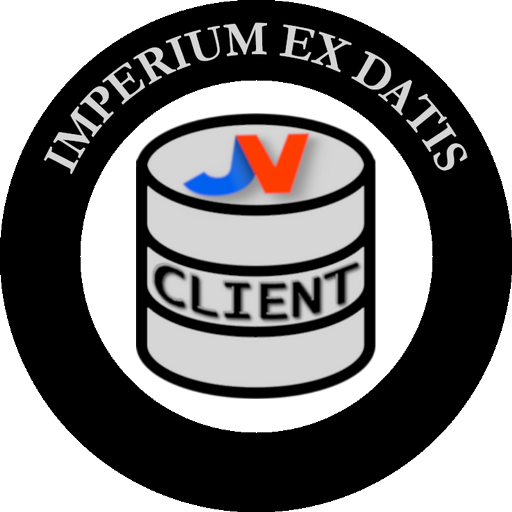

    <h1 align="center">JVClient</h1>
    <h2 align="center">Un client Node.js pour <a href="https://www.jeuxvideo.com">jeuxvideo.com</a></h2>
    

        </img>
    

**JVClient** est une librairie pour [Node.js](https://nodejs.org/en) qui permet d'interagir avec le site [jeuxvideo.com](https://www.jeuxvideo.com) et son API.

La documentation complète est trouvable [ici](https://contrapunctus-xiv.github.io/jv-client/).

### Motivations
Cette librairie a été conçue pour répondre à deux besoins :
- Récupérer des données à propos des contenus de la rédaction (articles, actualités, vidéos, etc.), des jeux vidéo répertoriés par JVC et des forums ;
- Rendre programmables les interactions qui nécessitent un compte JVC (poster des topics, des avis, modifier son profil, etc.).

### Ce que la librairie permet de faire
- Toute **récupération de données**, que ce soit au niveau des contenus de la rédaction, des jeux vidéo, des forums, des comptes, etc.
- Interagir avec les **contenus de la rédaction** : poster, supprimer, modifier des commentaires, etc.
- Interagir avec les **jeux vidéo** : publier et retirer des avis
- Modifier son **profil** public : description, jeux, topics et forums favoris, etc.
- Interagir avec les **forums** : poster ou supprimer des topics et des messages

### Ce que la librairie ne permet pas de faire
- Créer des comptes JVC
- DDB des messages
- Envoyer des messages privés

### Historique et remerciements

Dès que j'ai connu JVC en septembre 2022, j'ai cherché à développé des utilitaires autour de ce site.

En me rendant sur la page JVFlux titrée « [documentation de l'API de jeuxvideo.com](https://jvflux.fr/Documentation_de_l%27API_Jeuxvideo.com) », j'ai appris que JVC possédait une API (l'API v4) qui malheureusement n'était alors pas documentée. C'est grâce à un travail de rétro-ingéniérie, effectué par *ChristianRonald* et moi-même, que le recensement des *endpoints* de l'API a pu être effectué ; c'est également grâce à *edwado* qui avait auparavant codé une classe PHP pour générer le header `Jvc-Authorization`, condition d'accès à l'API v4. Sans ces deux personnes, la présente librairie n'aurait pu voir le jour.

### Contact
Pour toute question, je suis joignable sur Discord sous le pseudo `contrapunctus_1`.
